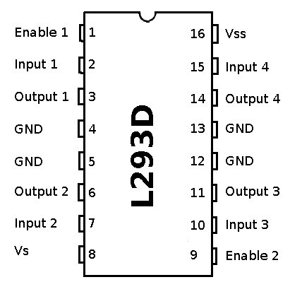
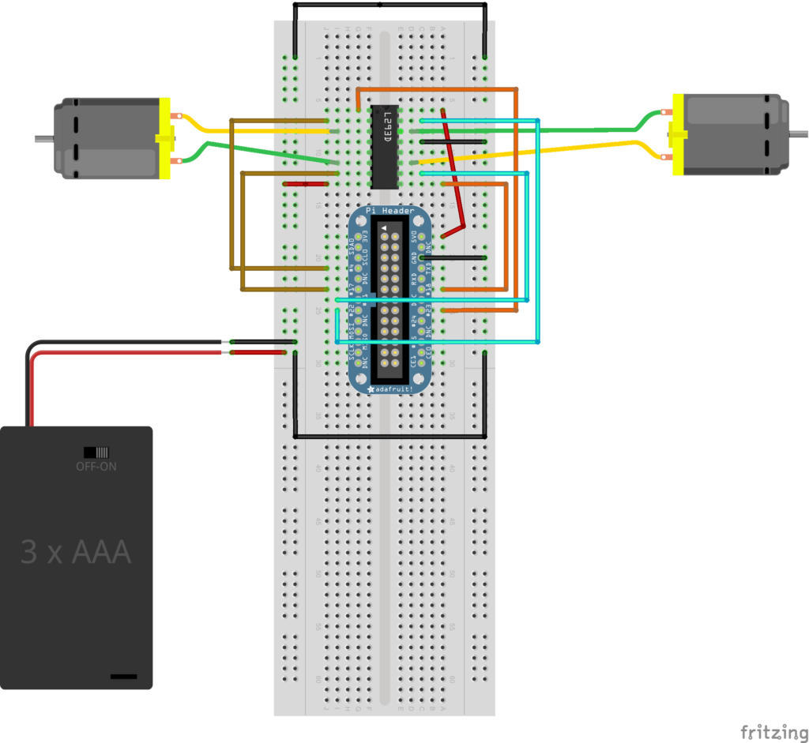
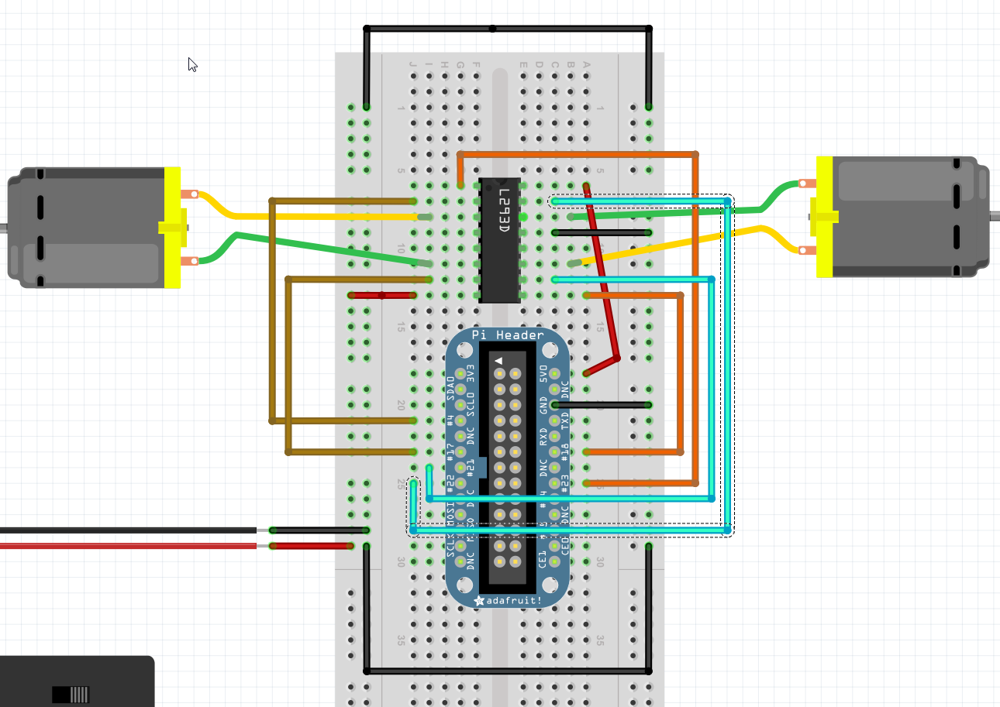
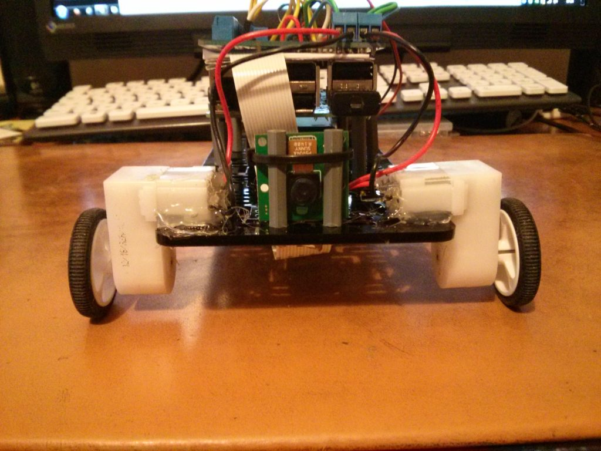
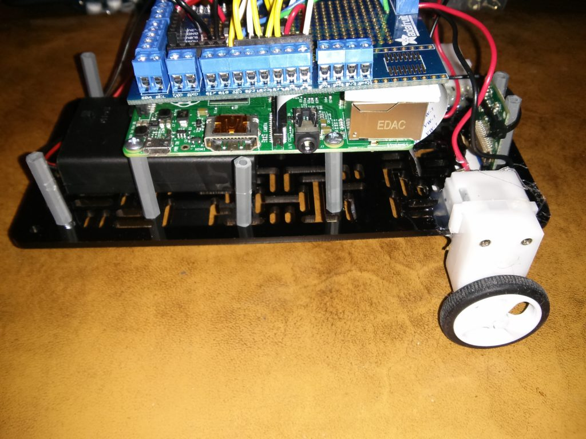
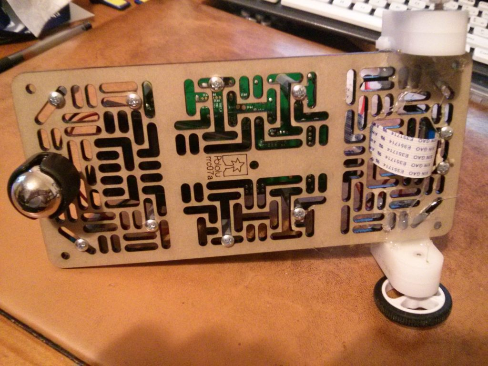
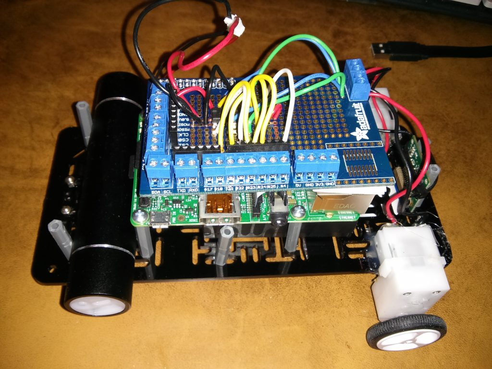
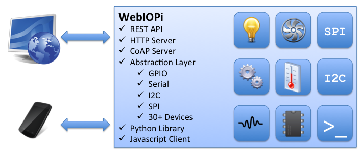
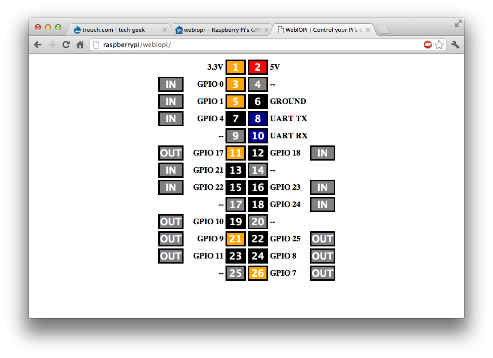
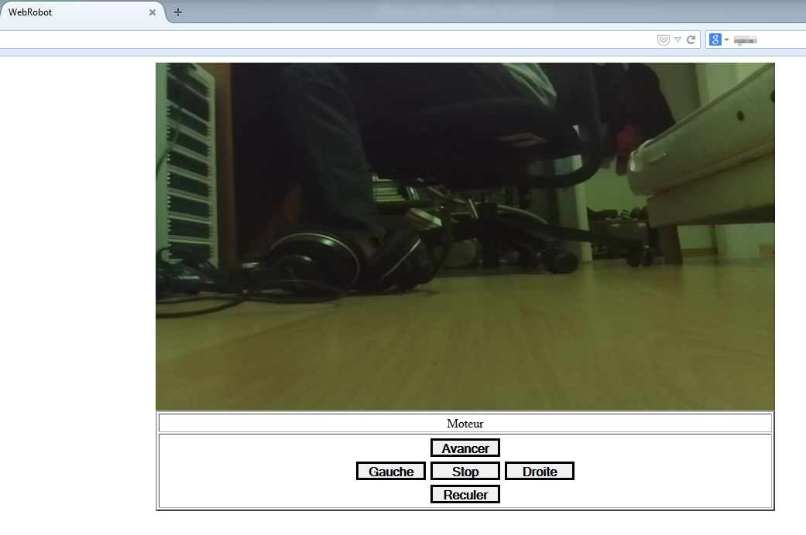

# PiCar

Projet de voiture télécommandé en Wifi, à base de Raspberri Pi et de sa caméra.

Ce projet date de 2018 et n'est plus à jour.

## Prototypage sur breadboard
Pour commander les moteurs, on ne peut pas directement les raccorder au Pi, car celui ci ne délivre que 5V, et qu’une vingtaine de mA, ce qui ne suffit pas pour des moteurs.

Du coup on utilise un composant qui s’appel : le L293D

Toutes mes explications viennent de l’excellent Wiki de http://mchobby.be/wiki/index.php?title=Pont-H_L293D




Le montage :




Attention, sur ce schéma la broche nommé #21 correspond à la broche nommé #27 sur un Pi B

Si on reprend le tableau :

| Broche | Nom      | Broche Cobbler / GPIO |   |   |
|--------|----------|-----------------------|---|---|
| 1      | Enable 1 | #23 / GPIO 4          |   |   |
| 2      | Input 1  | #4 / GPIO 7           |   |   |
| 3      | Output 1 | Moteur G              |   |   |
| 4      | GND      | Masse                 |   |   |
| 5      | GND      |                       |   |   |
| 6      | Output 2 | Moteur G              |   |   |
| 7      | Input 2  | #17 / GPIO 0          |   |   |
| 8      | VS       | + Batterie            |   |   |
| 9      | Enable 2 | #18 / GPIO 1          |   |   |
| 10     | Input 3  | #27 / GPIO 2          |   |   |
| 11     | Output 3 | Moteur D              |   |   |
| 12     | GND      |                       |   |   |
| 13     | GND      |                       |   |   |
| 14     | Output 4 | Moteur D              |   |   |
| 15     | Input 4  | #22 / GPIO 3          |   |   |
| 16     | VSS      | +5V Pi                |   |   |

Logique de commande du moteur gauche :

| Enable 1 / GPIO 4 | Input 1 / GPIO 7 | Input 2 / GPIO 0 | Fonction                        |
|-------------------|------------------|------------------|---------------------------------|
| High              | Low              | High             | Tourne dans le sens horaire     |
| High              | High             | Low              | tourne dans le sens antihoraire |
| High              | Low              | Low              | Stop                            |
| High              | High             | High             | Stop                            |
| Low               | Peu importe      | Peu importe      | Stop                            |

Sur le Pi, pour faire tourner le moteur gauche dans le sens horaire il faut :

1. Configurer les broches en mode sortie
```bash
gpio mode 4 OUT
gpio mode 7 OUT
gpio mode 0 OUT
```

2. Appliquer les bonnes tensions
```bash
gpio write 4 1
gpio write 0 1
```

Et ça tourne.

## Montage et test

Le prototype fonctionne, maintenant on monte la voiture pour de vrai.

Aussi les premiers tests avec un petit programme écrit en python

### Le matériel

Lors de ma première commande, j’avais déjà acheté une plaque robotique pour faire le chassis

J’ai du rajouter, car je n’avais pas encore :

- Un shield de prototypage à souder soit même, c’est plus propre que la breadboard.
- Une roulette à bille pour faire la troisième roue à l’arrière
- Des entretoises et des vis
- Un fer à souder et de l’étain
- Du fil avec un brain solide
- Une batterie externe pour alimenter le Pi

## Montage de la voiture

Pour le soudage du Shield, Adafruit a fait un excellent tuto ( https://learn.adafruit.com/adafruit-prototyping-pi-plate/solder-it ) dont je me suis servis pour souder le mien.






## Premier test

### Connecter le Pi au réseau Wifi

Je reviendrais pas sur la procédure pour connecter le Pi à un réseau Wifi.

Il y a tellement de sujet qui en parle ( cf Generation Linux pour Raspbian 7, framboise314 pour Raspbian 8 )

### Programme de test

Avant d’embarquer le code dans une page web avec le retour de la caméra je suis passé par ce petit code qui permet de simplement tester la conduite en SSH dans un terminal :

```python
#!/usr/bin/env python
#coding=utf-8
#    Ce programme permet de controler  la voiture robot avec les touches de clavier

#Déclaration
from time import sleep
import RPi.GPIO as GPIO
import sys, termios, atexit
from select import select   
import serial
from threading import Thread

out = serial.Serial('/dev/ttyAMA0',38400)


#Déclaration des GPIOs

#Moteur 1
EnA = 4
Out1 = 17
Out2 = 22
#Moteur2
EnB = 18
Out3 = 23
Out4 = 27

#Il existe 2 mode pour déclarer les GPIO, soit GPIO.BOARD soit GPIO.BCM
GPIO.setmode(GPIO.BCM)

###### Pour capturer les touches utilisés sur le clavier et lancer la bonne commande    ###### 
###### On utilise ce petit bout de code : http://code.activestate.com/recipes/572182/    ###### 

# save the terminal settings
fd = sys.stdin.fileno()
new_term = termios.tcgetattr(fd)
old_term = termios.tcgetattr(fd)

# new terminal setting unbuffered
new_term[3] = (new_term[3] &amp; ~termios.ICANON &amp; ~termios.ECHO)

# switch to normal terminal
def set_normal_term():
    termios.tcsetattr(fd, termios.TCSAFLUSH, old_term)

# switch to unbuffered terminal
def set_curses_term():
    termios.tcsetattr(fd, termios.TCSAFLUSH, new_term)

def putch(ch):
    sys.stdout.write(ch)

def getch():
    return sys.stdin.read(1)

def getche():
    ch = getch()
    putch(ch)
    return ch

def kbhit():
    dr,dw,de = select([sys.stdin], [], [], 0)
    return dr &lt;&gt; []
    
######         ######     SUITE PLUS TARD        ######             ###### 


# Fonction qui permet de faire avancer la voiture
# Pour rappel, les 2 enable à 1, et 1 commande de chaque moteur à 1
def Forward():
   GPIO.output(Out1,True)
   GPIO.output(Out3,True)
   GPIO.output(Out2,False)
   GPIO.output(Out4,False)
   GPIO.output(EnA,True)
   GPIO.output(EnB,True)

# Fonction qui permet de stopper la voiture

def Stop():
   GPIO.output(Out1,False)
   GPIO.output(Out3,False)
   GPIO.output(Out2,False)
   GPIO.output(Out4,False)
   GPIO.output(EnA,True)
   GPIO.output(EnB,True)

def Standby():
   GPIO.output(Out1,False)
   GPIO.output(Out3,False)
   GPIO.output(Out2,False)
   GPIO.output(Out4,False)
   GPIO.output(EnA,False)
   GPIO.output(EnB,False)

# Fonction qui permet de faire reculer la voiture
# Pour rappel, les 2 enable à 1, et 1 commande de chaque moteur à 1 ( les 2 qui étaient à 0 pour avancer )
def Reverse():
   GPIO.output(Out2,True)
   GPIO.output(Out4,True)
   GPIO.output(Out1,False)
   GPIO.output(Out3,False)
   GPIO.output(EnA,True)
   GPIO.output(EnB,True)
   
# Fonction qui permet de faire tourner la voiture à droite

def TurnRight():
   GPIO.output(Out1,True)
   GPIO.output(Out3,False)
   GPIO.output(Out2,False)
   GPIO.output(Out4,True)
   GPIO.output(EnA,True)
   GPIO.output(EnB,True)
   
# Fonction qui permet de faire tourner la voiture à gauche

def TurnLeft():
   GPIO.output(Out1,False)
   GPIO.output(Out3,True)
   GPIO.output(Out2,True)
   GPIO.output(Out4,False)
   GPIO.output(EnA,True)
   GPIO.output(EnB,True)


GPIO.setmode(GPIO.BCM)

# Déclaration Enable du moteur 1 en OUT
GPIO.setup(EnA,GPIO.OUT)
GPIO.output(EnA, False)

# Déclaration Enable du moteur 2 en OUT

GPIO.setup(EnB,GPIO.OUT)
GPIO.output(EnB, False)


# Déclaration des pins controle moteur en OUT

GPIO.setup(Out1,GPIO.OUT)
GPIO.setup(Out2,GPIO.OUT)
GPIO.setup(Out3,GPIO.OUT)
GPIO.setup(Out4,GPIO.OUT)

# Toutes les pins à 0

GPIO.output(Out1,False)
GPIO.output(Out2,False)
GPIO.output(Out3,False)
GPIO.output(Out4,False)


# Avant de commencer, test de chaque fonction
Forward()
sleep(1)
Reverse()
sleep(1)
TurnLeft()
sleep(5)
TurnRight()
sleep(5)
Stop()
sleep(1)
Standby()

###### Pour capturer les touches utilisés sur le clavier et lancer la bonne commande    ###### 
###### On utilise ce petit bout de code : http://code.activestate.com/recipes/572182/    ###### 
######                                 SUITE                                                ###### 

if __name__ == '__main__':
    atexit.register(set_normal_term)
    set_curses_term()

while True:
  key = getch()
  if key== "p":
   print "exit"
   break
  elif key=="s":
   Forward()
  elif key=="d":
   TurnLeft()
  elif key=="q":
   TurnRight()
  elif key=="z":
   Reverse()
  else:
   Stop()   
   
######                                 FIN                                                ###### 

Standby()
GPIO.cleanup()
```

Le code parle de lui même.

Si les touches sont inversés, plusieurs possibilités :

- Changer le sens des fils sur les bornes moteurs du Shield
- Inverse les touches dans le code ( plus facile )

Une vidéo :

[](https://www.youtube.com/watch?v=tTWgFqdgM5U)

# La caméra

Pour l’installation physique du module caméra la documentation officielle est disponible ici ( http://www.raspberrypi.org/documentation/usage/camera/README.md )

La commande vcgencmd get_camera permet de connaitre létat du module caméra :
```bash
pi@raspberry ~ $ vcgencmd get_camera
supported=1 detected=1
```
- Supported permet de savoir si votre système est configuré pour utiliser le module
- Detected permet de savoir si le système a bien détecté que le module est branché

Pour être certain :
```bash
pi@raspberry ~ $ raspistill -o cam.jpg
```
## MJPG-Streamer

MJPG-Streamer est un programme qui permet de transformer les photos prisent par la caméra en un flux vidéo visionable par HTTP, VLC, ..

Installation des prérequis
```bash
pi@raspberry ~ $ sudo apt-get install libjpeg8-dev cmake
```
Dans le dossier picar dans le home de pi ( /home/pi/picar ) nous allons télécharger le programme mjpg-streamer avec prise en charge du plugin raspicam :

```bash
pi@raspberry ~ $ git clone https://github.com/jacksonliam/mjpg-streamer.git ~/picar/mjpg-streamer
pi@raspberry ~ $ cd ~/picar/mjpg-streamer/mjpg-streamer-experimental
pi@raspberry ~ $ make
pi@raspberry ~ $ sudo make install
```
Voici 2 scripts pour lancer et arrêter le streaming de la caméra, à placer dans le dossier picar

Note : En fonction de l’endroit ou se trouve l’exécutable de mjpg-streamer, vous devrez peut être changer le script

Script de lancement :
```bash
#!/bin/bash
if pgrep mjpg_streamer &gt; /dev/null
 then
   echo "mjpg_streamer already running"
 else
  LD_LIBRARY_PATH=/home/pi/picar/mjpg-streamer/mjpg-streamer-experimental/ /home/pi/picar/mjpg-streamer/mjpg-streamer-experimental/mjpg_streamer -i "input_raspicam.so -fps 15 -q 50 -x 640 -y 480" -o "output_http.so -p 9000 -w /home/pi/picar/mjpg-streamer/mjpg-streamer-experimental/www" &gt; /dev/null 2&gt;&amp;1&amp;
  echo "mjpg_streamer started"
fi
```
Script d’arrêt :
```bash
#!/bin/bash
if pgrep mjpg_streamer
 then
   kill $(pgrep mjpg_streamer) &gt; /dev/null 2&gt;&amp;1
   echo "mjpg_streamer stopped"
 else
   echo "mjpg_streamer not running"
fi
```
Une fois l’application démarré rendez vous sur http://ADD.IP.DU.PI:9000 onglet « Stream »


## L’interface web

Pour contrôler la PiCar à partir d’une page web j’ai découvert le projet WebIOPi qui est spécialement conçu pour contrôler les ports GPIO du raspberry Pi grâce à python / javascript / html



Mise à jour 2018 : Webiopi a était arrêté en 2015 pour faire un dérivé commercial. Heuresement quelqu’un à reprit le projet et continue de le maintenir. On peut donc encore l’utiliser en 2018 et avec Debian Stretch. Merci à Thortex ( https://github.com/thortex/rpi3-webiopi )

## Installation de WebIOPi
```bash
#On clone le dépot git
git clone https://github.com/thortex/rpi3-webiopi.git
cd rpi3-webiopi
#Ensuite on se déplace dans le répertoire dev pour installer les prérequis
cd dev
./01_setup-required-packages.sh
./03_install_python_dev.sh
./10_make_deb.sh
#Une fois les paquets crées on peut passez à l'installation
sudo dpkg -i ~/build.webiopi/python2-webiopi*.deb
sudo webiopi-select-python 2
sudo systemctl daemon-reload
sudo systemctl restart webiopi
```

## Découverte de WebIOPi

Une fois installé, on peut tester les possibilités via la page d’exemple :
```bash
pi@raspberrypi ~ $ sudo webiopi
```
On se rend sur l’adresse IP du Pi : http://ADD.IP.DU.PI:8000

Le login et mot de passe par défaut sont : webiopi / raspberry

Rendez vous dans « GPIO Header  »



- Un clique sur OUT/IN permet de paramétrer un GPIO en mode entrée ou sortie
- Un clique sur le GPIO permet de changer l’état ( 0 ou 1 )

## Créer le projet PiCar avec WebIOPi

Créer 2 répertoires, un pour le code python et un autre pour les pages web dans le dossier picar ( /home/pi/picar ) :

```bash
>pi@raspberrypi ~ $ mkdir html python
```

Les fichiers à placer dans les dossiers sont sur dans le dépot.

Puis éditer le fichier /etc/webiopi/config pour configurer notre projet

- Localiser la section [SCRIPTS], et ajouter la ligne pour charger notre script python

```bash
 [SCRIPTS]
 myscript = /home/pi/picar/python/web.py
```

- Localiser la section [HTTP], et ajouter la ligne pour dire à WebIOPi ou trouver les pages webs

```bash
 [HTTP]
 doc-root = /home/pi/picar/html
```

Et voila !

Pour tester, il faut d’abord lancer le stream de la caméra ( via le script Live par exemple )

Puis le serveur WebIOPi avec :
```bash
pi@raspberrypi ~ $ sudo webiopi -c /etc/webiopi/config
```

Rendez vous maintenant sur http://ADD:IP:DU:PI:9000



Sur tablette ou smartphone, les fonctions html onmouseup et onmousedown ne fonctionne pas.

Supprimer les et utiliser plutôt le bouton Stop